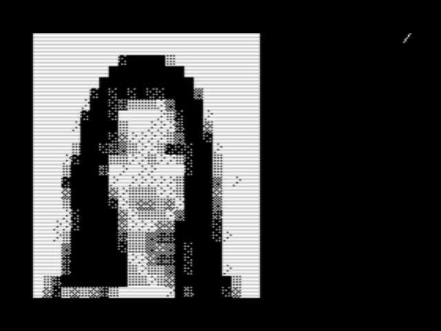
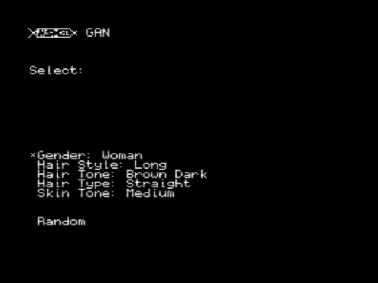
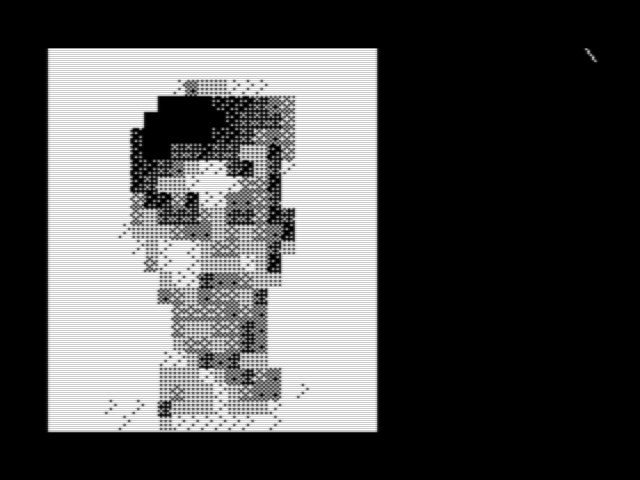
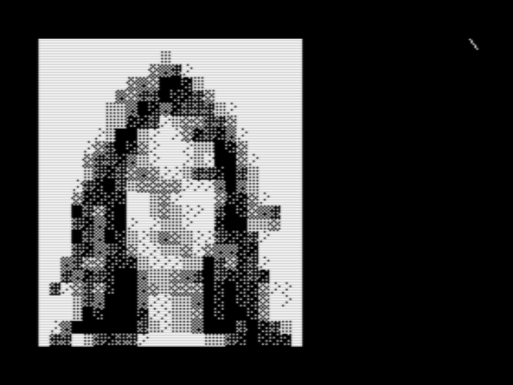
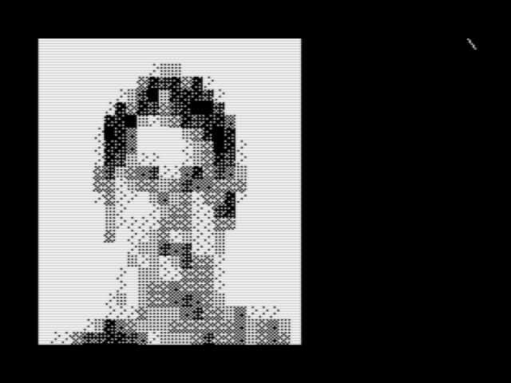
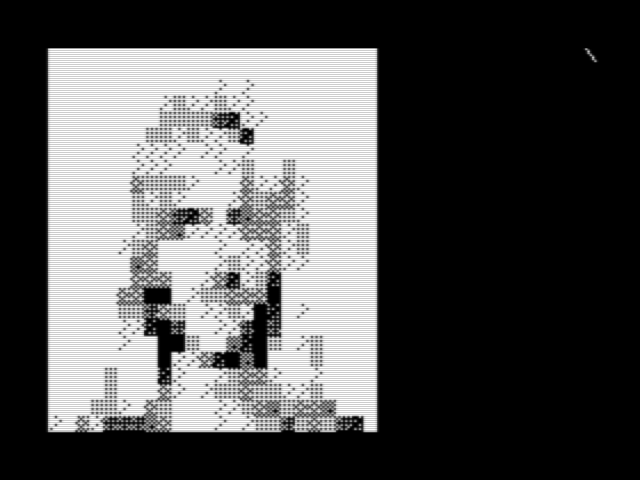
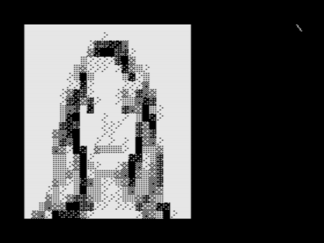
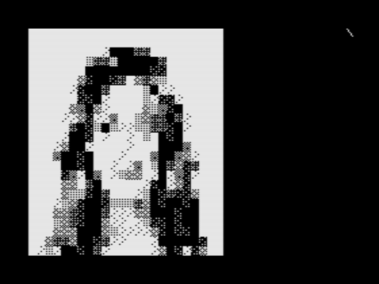
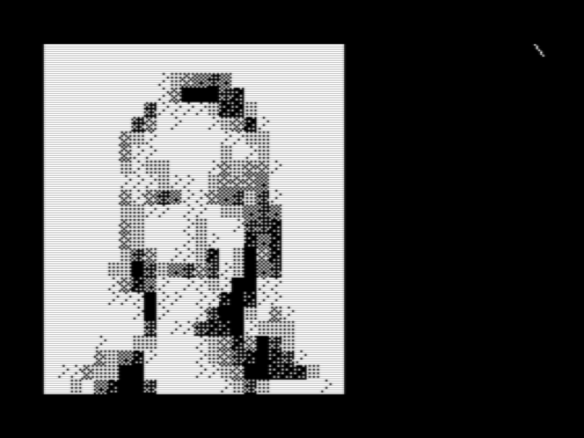
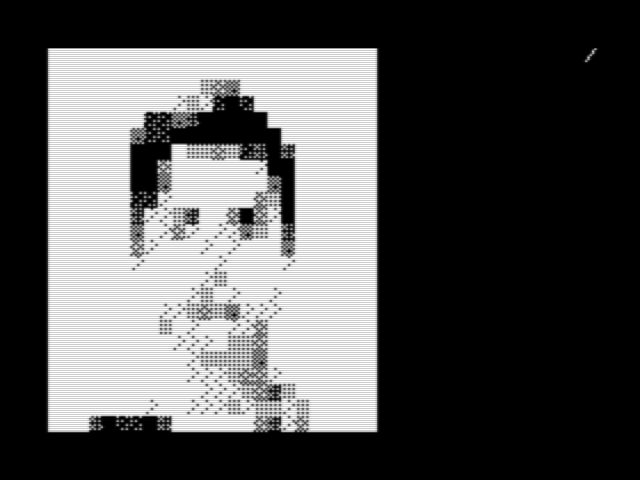

# MSX Portrait Generator

A neural network-based portrait generator running on MSX, an 8-bit computer powered by the Z80 processor. This project implements a complete pipeline from training a Generative Adversarial Network (GAN) to deploying it as a ROM cartridge for real MSX hardware.



## Overview

This project brings AI-generated portraits to the constraints of 1980s hardware. It generates 24x24 pixel monochrome portraits in real-time on the MSX, allowing users to customize physical characteristics or generate random portraits.

The generator uses a quantized Wasserstein GAN (WGAN) trained on portrait data, then converted to 8-bit integer operations that can run efficiently on the Z80 processor.

## Features

- **Customizable Portrait Generation**: Select specific physical characteristics:
  - Gender (Man/Woman)
  - Hair Style (Long/Medium/Short)
  - Hair Tone (Black/Dark Brown/Light Brown/Light)
  - Hair Type (Bald/Curly/Straight/Wavy)
  - Skin Tone (Dark/Medium)

- **Random Generation**: Generate completely random portraits with a single button press

- **Real Hardware Support**: Runs on actual MSX computers or emulators like openMSX

- **ROM Cartridge**: Packaged as a ROM file that can be loaded directly into MSX hardware


## Screenshots

### Selection Menu



### Generated Portraits
 

 

 

 


## Technical Details

### Architecture

- **Training Framework**: PyTorch-based WGAN  
- **Model**: Compact generator network optimized for 8-bit inference
- **Input**: 64-dimensional latent vector (z-space)
- **Output**: 24x24 pixel monochrome image
- **Runtime**: Pure C implementation with quantized integer operations
- **Target Hardware**: MSX (Z80 @ 3.58 MHz)

### Implementation

The network is converted to fixed-point format to run on MSX:
- Weights stored in ROM (not RAM or disk)
- Fixed-point arithmetic (primarily Q8 format, with some sections using 8.8 fixed-point)
- Integer-only operations (no floating point)
- Requires extensive mathematical optimizations for Z80
- Optimized matrix operations for Z80
- Uses only 32KB RAM bank (out of 64KB available) since weights are in ROM

### Display Characteristics

- **Output Resolution**: 24x24 pixels
- **Gray Levels**: Network generates 256 gray levels internally, but only 8 are displayed on screen
- **Screen Mode**: Uses MSX Screen Mode 1 (Text mode with custom characters)
- **Resolution Limitation**: 24x24 is the maximum practical resolution for Screen Mode 1. Higher resolutions would require more advanced screen modes (Screen 2, 4, etc.), potentially making the project incompatible with other computers in the same 8-bit category

### Training Dataset

The training dataset was **synthetically generated using Zimage Turbo**, so there is no interest in publishing the full dataset. However, sample images are available in [train/images_v6/faces/](train/images_v6/faces/) for reference.

## Project Structure

```
.
├── train/                      # Neural network training code
│   ├── train_wgan_v4.py       # Main training script (WGAN)
│   ├── model.py               # Network architecture definitions
│   ├── downscale.py           # Image preprocessing utilities
│   └── output_wgan_4bit_24/   # Trained model checkpoints
│
├── runtime/                    # C runtime for testing
│   ├── main_gen.c             # Standalone test program
│   ├── gen_runtime.c          # Generator inference engine
│   ├── gen_weights.h          # Exported network weights
│   ├── model.py               # Export utilities
│   └── export_gl.py           # Weight export script
│
├── src/                        # MSX cartridge source code
│   ├── dgan.c                 # Main application code
│   ├── dgan_s*.c              # Stage-specific implementations
│   ├── layer_i8*.c            # Quantized layer implementations
│   ├── layers.h               # Layer interface definitions
│   ├── weigths_export.h       # Network weights for MSX
│   ├── zmeans.h               # Latent space cluster centers
│   ├── build.sh               # Build script (Linux)
│   └── build.bat              # Build script (Windows)
│
├── cluster[Not public]/                    # Latent space analysis
│   ├── cluster.py             # K-means clustering on z-space
│   ├── compute_z_mean.py      # Compute characteristic vectors
│   ├── infer_classifier_batch.py  # Batch inference tool
│   └── data/                  # Cluster analysis data
│
├── infer/                      # Classifier inference tools
│   └── infer_classifier.py    # Portrait characteristic classifier
│
├── images/                     # Screenshots and demos
│
└── dgan.rom                    # Compiled MSX ROM cartridge
```

## Building the Project

### Prerequisites

- **For Training**:
  - Python 3.7+
  - PyTorch
  - torchvision
  - PIL/Pillow
  - NumPy

- **For MSX ROM**:
  - [MSXgl](https://github.com/aoineko-fr/MSXgl) development environment
  - SDCC compiler
  - Make

### Training the Network

The training dataset was synthetically generated using Zimage Turbo. Sample images are provided in `train/images_v6/faces/` for reference.

```bash
cd train
python train_wgan_v4.py --dataset train/images_v6/faces/ --epochs 200
```

### Exporting Weights

After training, export the quantized weights for the C runtime:

```bash
cd runtime
python export_gl.py
```

### Building the ROM

```bash
cd src
./build.sh  # Linux/Mac
# or
build.bat   # Windows
```

This will generate `dgan.rom` that can be loaded into MSX hardware or emulators.

## Running on MSX

### Using an Emulator (openMSX)

```bash
openmsx -cart dgan.rom
```

### On Real Hardware

1. Flash the ROM to a compatible MSX cartridge
2. Insert the cartridge into your MSX computer
3. Power on the system

## Usage

1. **Selection Menu**: Use arrow keys to navigate through options
2. **Choose Characteristics**: Select desired portrait features
3. **Generate**: Press the action button to generate a portrait
4. **Random Mode**: Select "Random" to generate unpredictable portraits

## Latent Space Clustering

The `cluster/` directory contains tools for analyzing the latent space:

- Compute mean z-vectors for specific characteristics
- Perform k-means clustering to discover portrait variations
- Generate datasets for characteristic classification

These tools help in creating the selection menu by mapping user choices to specific regions of the latent space.

## Performance

- **Generation Time**: ~20 minutes per portrait on real MSX hardware
- **Memory Usage**: Uses only 16KB RAM bank (weights stored in ROM)
- **ROM Size**: Approximately 128KB (including all network weights)

 
 

The `images/` directory contains more screenshots showing:
- Generated portrait examples with different characteristics
- Selection menu interface and navigation
- Random generation results

## Technical Challenges Solved

1. **Fixed-Point Conversion**: Converting floating-point neural network to fixed-point format (Q8 and 8.8)
2. **Mathematical Optimizations**: Extensive optimizations required for efficient Z80 execution
3. **Integer-Only Inference**: Implementing matrix operations without floating point hardware
4. **Memory Architecture**: Storing 128KB of weights in ROM while using only 16KB RAM
5. **Performance Optimization**: Achieving inference on a 3.58 MHz Z80 processor (~20 min per portrait)
6. **Display Constraints**: Reducing 256 internal gray levels to 8 displayable levels
7. **Latent Space Control**: Mapping discrete user-selected characteristics to continuous z-space vectors

## Known Limitations

- **Display Quality**: Network generates 256 gray levels, but only 8 can be displayed on screen
- **Resolution Cap**: 24x24 pixels is the maximum for Screen Mode 1 compatibility
- **User Interface**: Interface needs additional polish and refinement
- **Generation Time**: ~20 minutes per portrait on real hardware
- **Portability**: Higher resolutions would require advanced screen modes, potentially breaking compatibility with other 8-bit computers in the same category

## Future Improvements

- Interface polish and better user experience
- Support for different screen modes (Screen 2, Screen 4) for higher resolution/quality
- Color portrait generation
- Animation/morphing between portraits
- Save/load favorite portraits
- Expanded characteristic options
- Performance optimizations to reduce generation time

## License

This project is provided as-is for educational and personal use.

## Acknowledgments

- **MSXgl**: Excellent development framework for MSX
- **openMSX**: Essential for testing and development
- **PyTorch**: Training framework
- MSX community for hardware specifications and support

## Author

**Eraldo M R Junior**

Created as an exploration of running modern neural networks on vintage 8-bit hardware.

---

*Bringing AI to the 1980s, one portrait at a time.*
